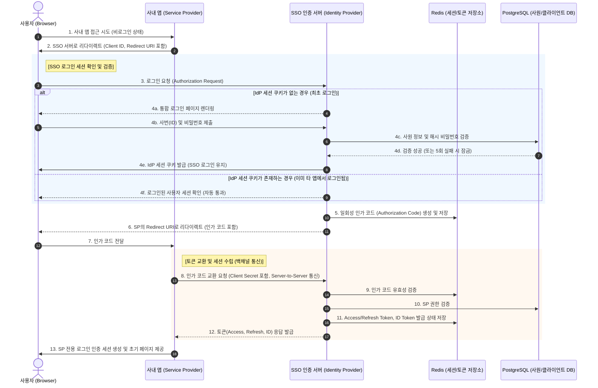
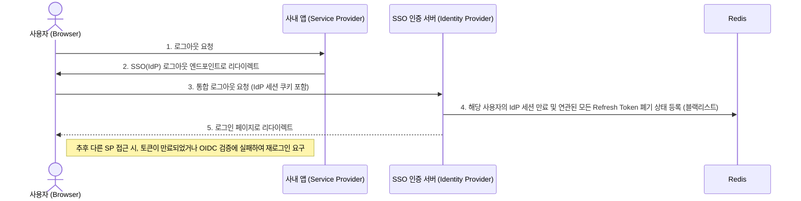

# 🏛️ 시스템 아키텍처 및 인증 설계서 (SSO System Architecture)

**프로젝트명:** 사원정보 기반 싱글 사인온(SSO) 통합 인증 관리 애플리케이션 (Lightkey SSO System)
**문서 작성자:** Architect Agent
**버전:** 1.0.0
**기반 문서:** PRD (v1.0.0)

---

## 1. 기술 스택 선정 (Technology Stack)

안전하고 고가용성을 보장하는 SSO 시스템 구축을 위해 최신 안정화 버전을 기준으로 다음의 기술 스택을 확정합니다. **모든 애플리케이션 서비스는 최초 개발 단계부터 반드시 컨테이너(Docker) 형태로 구축되어야 합니다.**

*   **Frontend (통합 로그인 창 & 대시보드):**
    *   **Next.js (v16):** SSR(Server-Side Rendering)을 지원하여 초기 로딩 속도 향상 및 React 최신 생태계 활용.
    *   **TailwindCSS (v4):** 일관되고 세련된 사내 로그인/동의 UI 컴포넌트 구성.
*   **Backend (SSO/IdP 인증 서버):**
    *   **NestJS (v11) + Node.js (v24):** 타입스크립트 기반으로 엔터프라이즈급 아키텍처 지원 및 뛰어난 에코시스템(Passport.js OIDC 모듈 등) 보유. 비동기 I/O를 통한 트래픽 처리 최적화.
*   **Database (RDBMS & In-Memory):**
    *   **PostgreSQL (v18):** 사원 데이터 및 OAuth 클라이언트(SP) 정보를 저장하는 메인 RDBMS. 강력한 트랜잭션 및 데이터 무결성 보장.
    *   **Redis (v8):** 중앙 집중식 세션 저장소. 통합 로그아웃(SLO) 처리, Refresh Token 블랙리스트 관리 및 인가 코드 캐싱 목적용 초고속 In-Memory 저장소.
*   **Infra / DevOps (컨테이너화 필수):**
    *   **Docker & Docker Compose:** 로컬 개발 환경부터 상용 배포까지 모든 환경을 동일한 컨테이너 기반으로 구동.
    *   **Kubernetes (K8s):** SSO 중앙 서버 다운 시 전사 로그인 장애를 방지하기 위한 무중단 배포 및 Scale-out 오케스트레이션.
    *   **Nginx / AWS ALB:** 리버스 프록시, SSL/TLS 로드밸런싱.

---

## 2. 보안 및 인증 아키텍처 (Security Architecture)

본 SSO 시스템은 **OAuth 2.0 인가 코드 흐름(Authorization Code Flow)과 OIDC(OpenID Connect)**를 기반으로 동작합니다.

*   **토큰 구조 (JWT):**
    *   `ID Token`: OIDC 기반 사내 애플리케이션(SP)에게 사용자의 신원(사번, 직급, 부서 등)을 증명하는 용도.
    *   `Access Token`: SP가 IdP 시스템의 자원(사용자 프로필 API 등)에 접근할 때 사용하는 권한 검증용 토큰. (수명: 15~30분)
    *   `Refresh Token`: Access Token 수명 만료 시 자동 갱신을 위한 토큰. **반드시 Redis에서 발급 이력을 관리하여 강제 로그아웃/만료(Revoke)를 가능하게 함.** (수명: 1~7일)
*   **쿠키 정책 (IdP 세션):** SSO 중앙 인증 서버에 로그인된 상태(세션)는 클라이언트의 브라우저에 **`HttpOnly, Secure, SameSite=Lax/Strict` 쿠키** 기반으로 저장되어, 다른 브라우저 탭에서의 XSS 공격으로부터 철저히 보호됩니다.

---

## 3. 인증 흐름도 (SSO Auth Flow Diagram)

사내 애플리케이션(Service Provider, 예: 그룹웨어)에서 SSO 중앙 시스템(Identity Provider)을 통해 로그인하는 과정입니다.

---

## 4. 통합 로그아웃 흐름도 (SLO - Single Log-Out)

사용자가 하나의 서비스에서 로그아웃하면 모든 연동된 서비스에서 로그아웃되는 구조입니다.

---

## 5. 다음 단계 제안
1. **Frontend Agent:** 위 Sequence 상의 로그인 폼(4a~4b 단계) 및 관리자 대시보드 화면 설계/구현.
2. **Backend / DBA Agent:** OIDC 기반 OAuth 클라이언트 발급 스키마 및 위 흐름도를 구동할 API(인증/토큰 교환) 모델링 구축.
