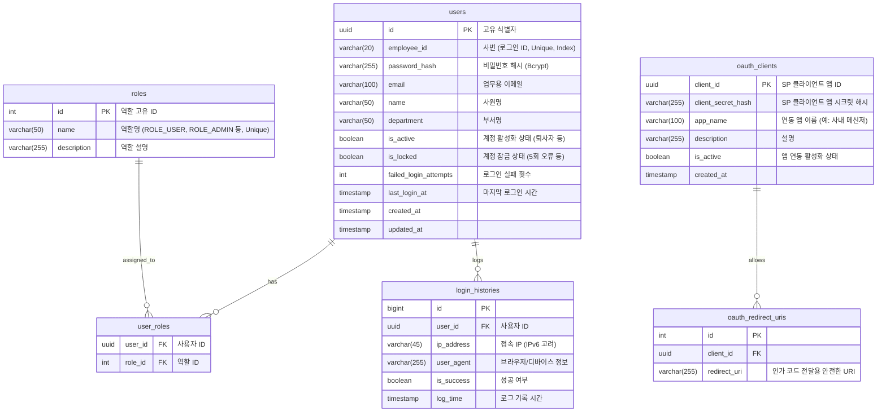

# 🗄️ 데이터베이스 스키마 설계서 (Database Schema/ERD)

**프로젝트명:** Lightkey SSO System
**문서 작성자:** DBA Agent
**데이터베이스:** PostgreSQL (v18), Redis (v8)
**버전:** 1.0.0

---

## 1. PostgreSQL ERD (Entity Relationship Diagram)

사원 정보, 권한 그룹, OAuth 서비스 연동 정보를 관리하는 핵심 영구 저장소 스키마입니다.

### 주요 보안 및 성능 전략 (PostgreSQL)
1. **패스워드 저장:** `password_hash`는 Bcrypt(Work Factor 10 이상) 혹은 Argon2id를 적용한 해시값만 저장합니다.
2. **인덱스 설계:** 
   - `users` 테이블의 `employee_id`는 필수적으로 B-Tree 인덱스(UNIQUE)를 걸어 빠른 로그인 처리를 보장합니다.
   - `login_histories` 테이블의 `log_time` 및 `user_id`를 묶어 복합 인덱스를 구성하여 관리자 대시보드 조회 성능을 향상시킵니다.
3. **Soft Delete:** 퇴사자 계정 삭제 시 실제 행을 `DELETE`하지 않고 `is_active = FALSE`로 처리하여 이력을 보존합니다.

---

## 2. Redis Key 구조 (In-Memory Data Store)

SSO의 고가용성과 세션 관리를 담당하는 휘발성/초고속 데이터 저장 스키마입니다.

| Key Pattern | 데이터 타입 | 용도 (TTL/수명) | 비고 |
| :--- | :--- | :--- | :--- |
| `session:idp:{session_id}` | Hash 또는 JSON | SSO 중앙 로그인 세션 관리용. (예: `{ userId: "uuid", ip: "..." }`) | 브라우저 쿠키(Session Cookie)의 수명과 일치하게 TTL 설정 |
| `auth_code:{code}` | String | SP로 넘겨줄 1회성 `Authorization Code` 저장 목적. (값: 연관된 `userId`와 `clientId`) | **유효기간 매우 짧음 (약 3~5분 TTL)**. 교환 시 즉시 삭제 (One-time use) |
| `refresh_token:{user_id}:{device_id}` | String | OIDC/OAuth Refresh Token을 저장. 화이트리스트(Whitelist) 방식 관리. | **유효기간 긺 (예: 7일 TTL)**. 강제 만료(SLO) 시 이 키를 삭제. 값으로 실제 JWT의 Signature가 들어감. |
| `lockout:{employee_id}` | String | 사번 기준 5회 실패 시, 임시 잠금 타이머를 적용할 때 사용 | (예: 30분 TTL) 만료 시 자동 잠금 해제 설정 활용 |

### 주요 보안 및 성능 전략 (Redis)
1. **Refresh Token 화이트리스트 통제:** 발급된 Refresh Token의 핵심 식별자를 Redis에 관리함으로써, SSO 관리자가 특정 사용자의 특정 디바이스 세션만 완벽히 무효화 시킬 수 있게 합니다.
2. **원자성 보장:** `auth_code`의 경우 `GET` 후 즉시 `DEL`을 보장하기 위해 Transaction(`MULTI`/`EXEC`) 또는 Lua Script를 적용합니다.
